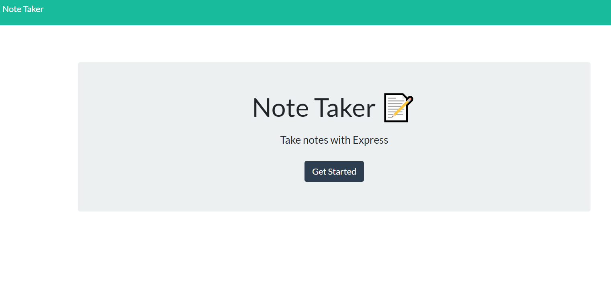
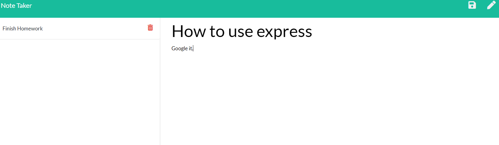

# note_taker

## Introduction

This is a simple app for taking notes, storing them, and deleting them. It uses node express for writing the api and html routes and is deployed through heroku.

## Technologies

Project is created with:

* Visual Studio Code 1.51.1
* Jquery 3.6.0
* node.js
* express.js

## Screenshot

## Link

[Note Taker](https://quiet-scrubland-92784.herokuapp.com/)